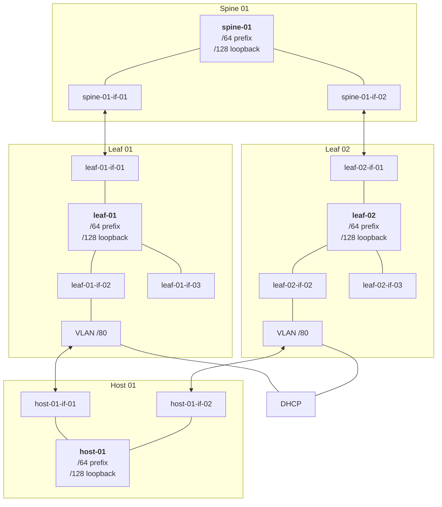

# Concept

## Setup

Our network follows a CLOS topology: A level of spines, leaves
and hosts connected to the leaves.

Each host is connected to two leaves and each leave is connected to
two spines for extra redundancy.

The connection towards the hosts from the leaves is also 'wrapped'
with a VLAN per interface since only by using VLANs, DHCP relay
can be specified. This is necessary to be able to boot servers
using network boot (PXE / HTTP).

Each member of the topology (spine, leaf, host) runs BGP unnumbered
for route distribution.

Diagram of an excerpt of how our network looks like:



For configuring our switches we use ZTP (zero-touch-provisioning).
We render the configuration from a template, since we know how our
cabling looks like. To keep the template small we use BGP unnumbered,
allowing us to omit each neighbor's ASN number.

This setup configures switches *once*, avoiding frequent switch
reconfiguration. Switch reconfiguration is known to be one of the
core issues causing severe network disruption.

## Declarative Network Design

The API for network modeling must solely focus on establishing the
desired topology. As such, concerns like device authentication or
initial device provisioning must not be part of the scope of this API
and will be abstracted behind known Kubernetes interfaces.

When designing the resources for our network, we start with
the ground truths we know about: Our cabling / topology plan.

At the cluster scope, we define the following types:

* **`Device`** representing an 'unconfigured' switch.
* **`DeviceInterface`** representing an interface of a device.
* **`Server`** representing an arbitrary host.
* **`ServerInterface`** representing an interface of a server.

We divice between devices and servers since devices and their
interfaces can be reconciled (e.g. set admin state `Up` / `Down`,
apply some configuration) while servers are externally managed (e.g.
by their OS / config).

The cluster-scoped **`Link`** resource specifies which interface
(either `DeviceInterface` or `ServerInterface`) is linked to each other.
For each such connection, a `Link` is created.

To actually make a `Device` be a real switch inside the network,
routing traffic properly, a namespaced `Switch` resource is created.
This `Switch` resource references a `Device` and, once accepted by
the `Device`, the `Device` references the `Switch` back. The spec
of a `Switch` is immutable. Once a `Switch` is created, this causes
the underlying device to be reconfigured. By having a dedicated `Switch`
resource, we gain several core benefits:

* Reconfiguration becomes explicit: We do not want to continuously
  reconfigure a switch but only configure it as seldom as possible.
  A single object contains everything needed to configure the switch.

* Having a single object means the implementors of this API can construct
  the most optimal way to apply the entire configuration: E.g. depending
  on the vendor, the sequence to apply a configuration can heavily differ.
  Having the entire desired configuration at once is the only allow a vendor
  to implement this correctly.

* By having a `Switch` resource that expresses the effective configuration,
  rolling / draining traffic and gracefully switching between two `Switch`
  configurations can be done. One could e.g. think of a higher-level type
  and controller that first drains traffic, removes the old `Switch` object
  once drained and creates a new one once ready.

Since servers also cooperatively take part in our networking, a `Host` resource
is what a `Switch` is to a `Device`: It expresses how a `Host` should join the network.
In contrast to a `Switch` however, this is not reconciled on a switch level but
depends on the server itself.

## Sample Resources

Spine (cluster-scoped):

```yaml
apiVersion: wire.ironcore.dev
kind: Device
metadata:
    name: spine-01
spec:
  providerID: sonic://spine-01
---
apiVersion: wire.ironcore.dev
kind: DeviceInterface
metadata:
  name: spine-01-if-01
spec:
  adminState: Up
  handle: sonic://interface-01
  deviceRef:
    name: spine-01
```

Leaf (cluster-scoped):

```yaml
apiVersion: wire.ironcore.dev
kind: Device
metadata:
    name: leaf-01
spec:
  providerID: sonic://leaf-01
---
apiVersion: wire.ironcore.dev
kind: DeviceInterface
metadata:
  name: leaf-01-if-01
spec:
  adminState: Up
  handle: sonic://interface-01-breakout-01
  deviceRef:
    name: leaf-01
---
apiVersion: wire.ironcore.dev
kind: DeviceInterface
metadata:
  name: leaf-01-if-02
spec:
  adminState: Up
  handle: sonic://interface-01-breakout-02
  deviceRef:
    name: leaf-01
```

Host (cluster-scoped):

```yaml
apiVersion: wire.ironcore.dev
kind: Server
metadata:
    name: host-01
---
apiVersion: wire.ironcore.dev
kind: ServerInterface
metadata:
  name: host-01-if-01
serverRef:
  name: host-01
```

Links (cluster-scoped):

```yaml
apiVersion: wire.ironcore.dev
kind: Link
metadata:
    name: spine-01-if-01-leaf-01-if-01
endpoints:
- deviceInterfaceRef:
    name: spine-01-if-01
- deviceInterfaceRef:
    name: leaf-01-if-01
---
apiVersion: wire.ironcore.dev
kind: Link
metadata:
  name: leaf-01-if-02-host-01-if-01
endpoints:
- deviceInterfaceRef:
    name: leaf-01-if-02
- deviceInterfaceRef:
    name: host-01-if-01
```

Spine switch (namespaced):

```yaml
apiVersion: wire.ironcore.dev
kind: Switch
metadata:
  namespace: my-lab
  name: spine-01
spec:
  ips:
  - loopback ip
  prefixes:
  - prefix
  deviceRef:
    name: spine-01
  bgp:
    asn: 0001
    peerGroups:
    - name: leafs
      neighbors:
      - interfaceRef:
          name: spine-01-if-01
```

Leaf switch (namespaced):

```yaml
apiVersion: wire.ironcore.dev
kind: Switch
metadata:
  namespace: my-lab
  name: leaf-01
spec:
  ips:
  - loopback ip
  prefixes:
  - prefix
  deviceRef:
    name: leaf-01
  vlans:
  - id: 1000
    prefix: foo/80
    dhcpRelay: my-dhcp-server
    serverInterfaceRefs:
    - name: leaf-01-if-02
  bgp:
    asn: 0002
    peerGroups:
    - name: spines
      neighbors:
      - interfaceRef:
          name: leaf-01-if-01
    - name: leafs
      neighbors:
      - vlan: 1000
```

Host (namespaced):

```yaml
apiVersion: wire.ironcore.dev
kind: Host
metadata:
  namespace: my-lab
  name: host-01
spec:
  ips:
  - ip1
  prefixes:
  - prefix
  serverRef:
    name: host-01
  bgp:
    asn: 0003
    peerGroups:
    - name: leafs
      neighbors:
      - deviceInterfaceRef:
          name: host-01-if-01
```
